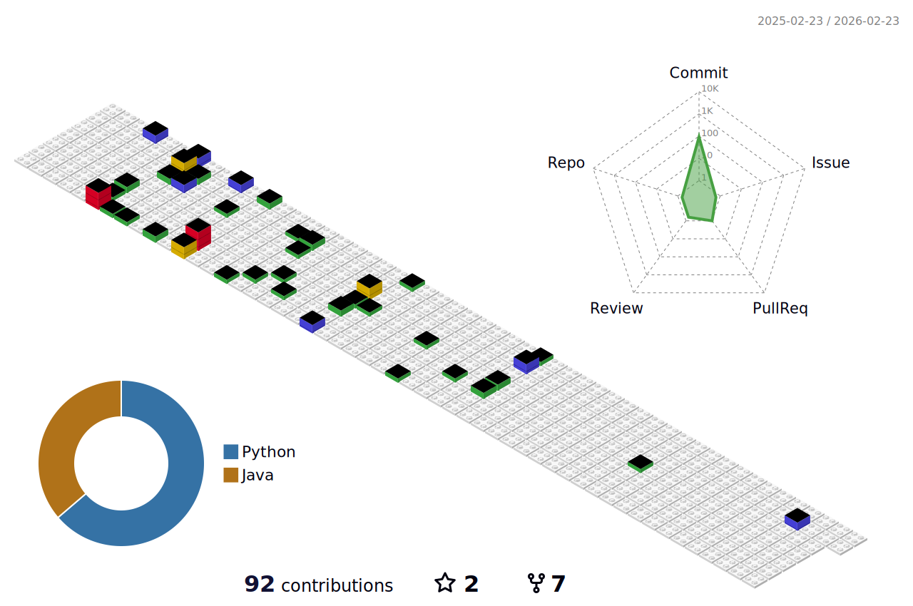

  👋 Hello! I am a backend engineer. 💻✨

## 
Interested Tech Stack and Tools 🛠️

  
  
  
  
  
  
  

  

  

## 
Blog 🌱

  

<!-- START_CUSTOM_SECTION -->

<!-- START_CUSTOM_SECTION -->
### 📝 최신 블로그 포스트

- 📰 [2025/04/17 - [공부 시간 기록/개발일지] (3) DTO, VO, ??? 그럼 DDD끼리 데이터 교환은? 아니 그전에 동기 비동기가 뭔지부터 알아야지](https://naturecancoding.tistory.com/157)
- 📰 [2025/04/06 - [공부 시간 기록/개발일지] (2) DDD? (내 방식대로 해보기)](https://naturecancoding.tistory.com/156)
- 📰 [2025/04/05 - [공부 시간 기록/개발일지] (1) WakaTime을 이용해보자!](https://naturecancoding.tistory.com/155)
- 📰 [2025/04/05 - [Java/기초] 인텔리제이 javadoc 자동화?](https://naturecancoding.tistory.com/154)
- 📰 [2025/04/03 - [Python/기초] 조합과 순열](https://naturecancoding.tistory.com/153)
- 📰 [2025/02/06 - [Python/백준] 1749_점수따먹기 (누적합)](https://naturecancoding.tistory.com/152)
- 📰 [2025/01/15 - 나는 성장 지향적인 태도를 가지고 있는가?](https://naturecancoding.tistory.com/151)

<!-- END_CUSTOM_SECTION -->
<!-- END_CUSTOM_SECTION -->

<!-- 3D 잔디 -->

