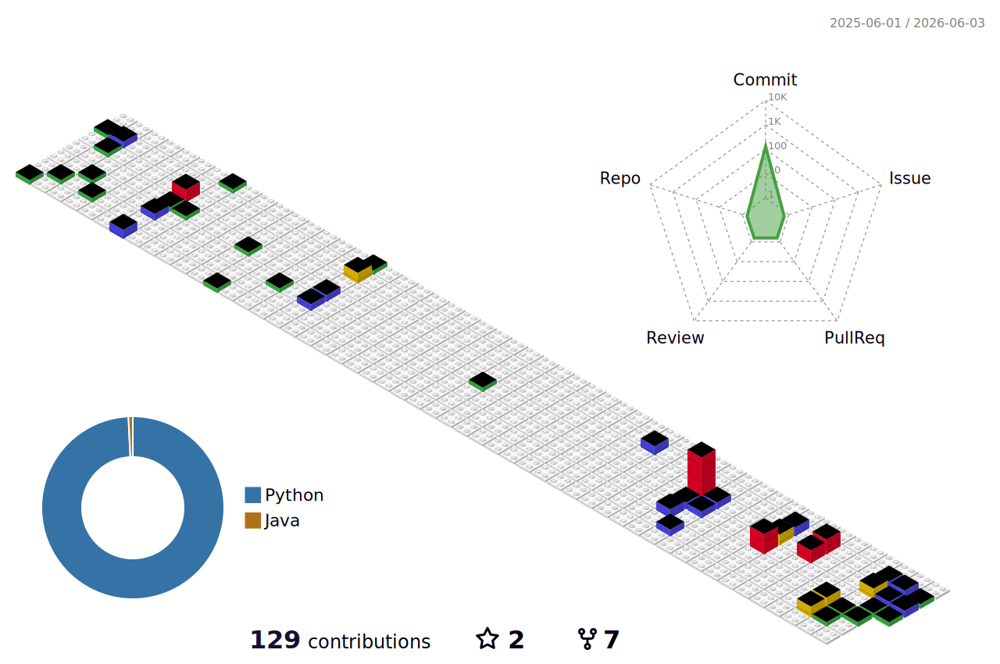

  👋 Hello! I am a backend engineer. 💻✨

## 
Interested Tech Stack and Tools 🛠️

  
  
  
  
  
  
  

  

  

## 
Blog 🌱

  

<!-- START_CUSTOM_SECTION -->

<!-- START_CUSTOM_SECTION -->
### 📝 최신 블로그 포스트

- 📰 [2026/05/18 - [오늘의 시간표/문서] 오늘의 시간표 서비스 개인정보 처리방침 (v1.0.0)](https://naturecancoding.tistory.com/168)
- 📰 [2025/12/02 - [Docker/저장공간] Docker 용량 이상 (WSL2, VHDX)](https://naturecancoding.tistory.com/167)
- 📰 [2025/09/10 - [Server/ssh] SSH 접속 및 private, public key 이해하기](https://naturecancoding.tistory.com/166)
- 📰 [2025/09/10 - [Server/Linux] ubuntu 기반 VM ssh key 등록](https://naturecancoding.tistory.com/165)
- 📰 [2025/08/29 - [Monitoring/Loki] Grafana Cloud &amp; Loki &amp; Promtail 사용기 (돈이 없지만 모니터링, 로그수집은 하고싶어) 2](https://naturecancoding.tistory.com/164)
- 📰 [2025/08/19 - [Monitoring/Loki] Grafana Cloud &amp; Loki &amp; Promtail 사용기 (돈이 없지만 모니터링, 로그수집은 하고싶어)](https://naturecancoding.tistory.com/163)
- 📰 [2025/06/26 - [JAVA/기초] LineNumberReader + 1 문제](https://naturecancoding.tistory.com/162)

<!-- END_CUSTOM_SECTION -->
<!-- END_CUSTOM_SECTION -->

<!-- 3D 잔디 -->

